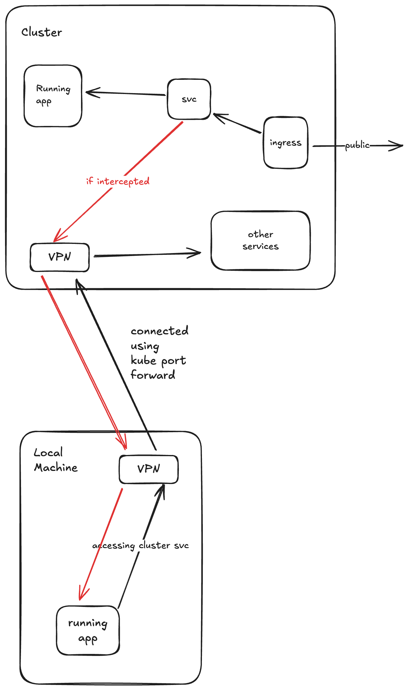

# inkube

> Be in the cluster, without being in the cluster. Develop locally with real cluster context.

---

## 🔍 Overview

**inkube** enables developers to run their services locally while mirroring the runtime environment of a Kubernetes pod. This means:

- You get access to the **same environment variables, secrets, and config maps** as the pod.
- Network **traffic to and from the pod is intercepted** and redirected to your local service.
- You can **test, debug, and iterate** locally, with full cluster integration — no redeploys needed.

---

## ✨ Features

- 🧩 **Pod Environment Mirroring**: Clone envs, secrets, ConfigMaps, and volumes from an existing pod.
- 🌐 **Traffic Interception**: Seamlessly redirect traffic between the cluster and your local machine.
- 🔐 **Secrets Mounting**: Automatically mount Kubernetes secrets locally in memory or as files.
- 🧪 **Live Development Mode**: Run and test services locally while communicating with real cluster services.
- 🎯 **Namespace + Context Targeting**: Select specific contexts and namespaces per session.

---

##  Architecture

> ⚠️ inkube is currently in **development**.
