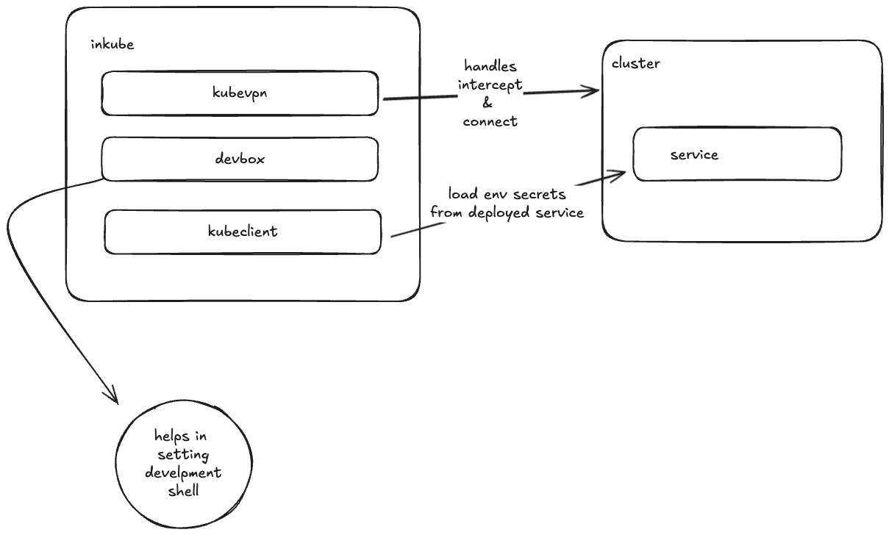

# inkube - Be in the cluster, without being in the cluster.


> Run your services locally while mirroring the runtime environment of a Kubernetes pod. Get cluster access, environment variables and also tunnel traffic to your local machine from kubernetes cluster.

---

## 🔍 Overview

**inkube** enables developers to run their services locally while mirroring the runtime environment of a Kubernetes pod. This means:

- You get access to the **same environment variables, secrets, and config maps** as the pod.
- Network **traffic to and from the pod is intercepted** and redirected to your local service.
- You can **test, debug, and iterate** locally, with full cluster integration — no redeploys needed.


---

## ✨ Features

- 🧩 **Pod Environment Mirroring**: Clone envs, secrets, ConfigMaps, and volumes from an existing pod.
- 🌐 **Traffic Interception**: Seamlessly redirect traffic between the cluster and your local machine.
- 🔐 **Secrets Mounting**: Automatically mount Kubernetes secrets locally in memory or as files.
- 🧪 **Live Development Mode**: Run and test services locally while communicating with real cluster services.
- 🎯 **Namespace + Context Targeting**: Select specific contexts and namespaces per session.

---

##  Architecture



### ⚙️ Prerequisites

- kubeconfig file
- [kubevpn](https://github.com/kubenetworks/kubevpn)
- [devbox](https://www.jetify.com/docs/devbox/installing_devbox)
- [nix](https://nixos.org/download/) will be automatically installed by devbox

> Please make sure you fullfill the prerequisites before using inkube.


> ⚠️ Do not use in production clusters, this is only for development clusters and making devlopment easier.

### 📦 Installation

```bash
# install the binary
go install github.com/abdheshnayak/inkube@latest
```

### 🚀 Usage

```bash
# create a new devbox config file
devbox init

# create a new inkube config file
inkube init
```

This command will create a `inkube.yaml` file in the current directory, which will be used to store the configuration for inkube.

```bash
# switch to a different namespace and context
inkube switch
```

This command will prompt you to select a namespace and context from the list of available namespaces and contexts.

```bash
# start a live development session
inkube dev
```

This command will start a live development session, intercepting the selected pod and connecting to it. and also bring environment variables of that container.

```bash
# connect to cluster based on inkube config
inkube connect
```

This command will connect to the cluster based on the configuration in the inkube.yaml file.

```
# disconnect from cluster
inkube disconnect
```

This command will disconnect from the cluster, and quit the live development session.

```bash
# intercept a running pod
inkube intercept
```

This command will intercept a running pod and connect to it.


```bash
# leave an intercepted pod
inkube leave
```
This command will close interception from the pod, and acutual service will start running.

```bash
# quit the live development session

exit # when you will exit the shell, the session will be quit

# or
inkube quit
```

This command will quit the live development session. including connection, interception and env vars.

---

## 📝 License

Copyright © 2025 [Abhishek Nayak](https://github.com/abdheshnayak).<br />
This project is [Apache 2.0](./LICENSE) licensed.


> ⚠️ inkube is currently in **development**.
